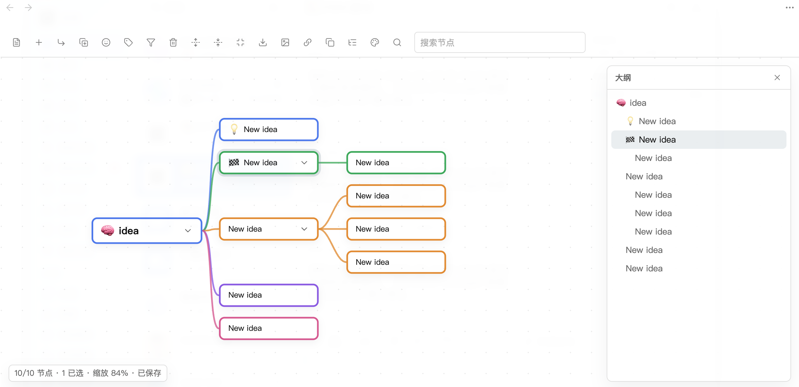

# linkmind

[中文文档](./README.zh.md)

Edit Markdown notes as interactive mind maps in Obsidian. linkmind renders headings and lists as a clean SVG + DOM mind map, writes every edit back to plain Markdown, and stays out of your way.

## Features

- **Markdown-native** -- headings and bullet lists become the mind map tree; edits sync back as plain Markdown.
- **Keyboard-driven editing** -- `Tab` to add a child, `Enter` to add a sibling, `F2` to edit, arrow keys to navigate, `Alt + Arrows` to restructure.
- **Drag & drop** -- drag nodes to reorder or reparent, including long-press on touch devices.
- **Right-facing or balanced layout** -- choose a classic tree or a two-sided map in settings.
- **Emoji icons & tags** -- add emoji icons and `#tags` to nodes; filter the map by tag.
- **Cross-branch links** -- dashed association lines drawn automatically for `[[#Heading]]` and `[[Heading]]` wikilinks.
- **Collapsible outline** -- navigate large maps with a built-in outline panel.
- **Undo & redo** -- local history stack with `Ctrl/Cmd + Z` and `Ctrl/Cmd + Shift + Z`.
- **Export** -- export the full map or a selected branch as SVG or PNG.
- **Multi-select** -- `Ctrl/Cmd + Click`, `Shift + Click`, or `Ctrl/Cmd + A`.
- **Copy & paste** -- copy a branch as Markdown, paste Markdown as new nodes.
- **Node links** -- copy an `obsidian://open` URI for any node.
- **Bilingual UI** -- Chinese and English interface.
- **Mobile-friendly** -- responsive toolbar and touch support.

## Keyboard Shortcuts

| Shortcut | Action |
|---|---|
| `Tab` | Add child node |
| `Enter` | Add sibling node |
| `F2` | Edit selected node |
| `Delete` / `Backspace` | Delete selected node |
| `Space` | Toggle collapse |
| `/` | Focus search |
| `Alt/Option + Arrow` | Move / indent / outdent node |
| `Ctrl/Cmd + Z` | Undo |
| `Ctrl/Cmd + Shift + Z` | Redo |
| `Ctrl/Cmd + A` | Select all nodes |
| `Ctrl/Cmd + =` / `-` | Zoom in / out |
| `Ctrl/Cmd + Shift + F` | Fit map to view |
| `Ctrl/Cmd + F` | Focus selected node |

## Installation

1. Download `main.js`, `manifest.json`, and `styles.css` from the [latest release](https://github.com/qiuos/linkmind/releases).
2. Create a folder named `linkmind` inside your vault's `.obsidian/plugins/` directory.
3. Copy the three files into that folder.
4. Open Obsidian Settings > Community plugins, refresh the list, and enable **linkmind**.

`styles.css` is optional, but recommended.

## Usage

1. Open any Markdown note that contains headings or bullet lists.
2. Click the brain icon in the left ribbon, or run **"Open current note as mind map"** from the command palette.
3. Edit nodes, restructure the tree, and export -- all changes are saved back to Markdown automatically.

## Screenshots

## Settings

| Setting | Default | Description |
|---|---|---|
| Language | Chinese | UI language (Chinese / English) |
| Auto-save delay | 300 ms | Delay before writing edits back to Markdown |
| Default expand depth | 99 | Levels expanded on open (99 = all) |
| Layout direction | Right | Right-facing tree or balanced two-sided |
| Layout animation | On | Animate node movement after edits |
| Show association links | On | Dashed lines for local wikilinks |
| Branch colors | 5 preset colors | CSS colors for first-level branches |
| PNG export scale | 2x | Resolution multiplier for PNG export |
| Transparent PNG | Off | Transparent background in PNG exports |

## License

[MIT](./LICENSE)
